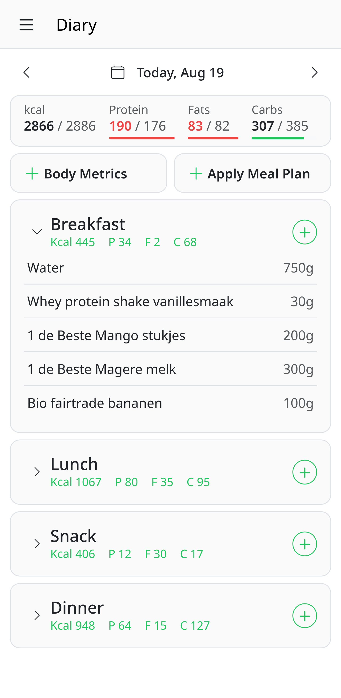
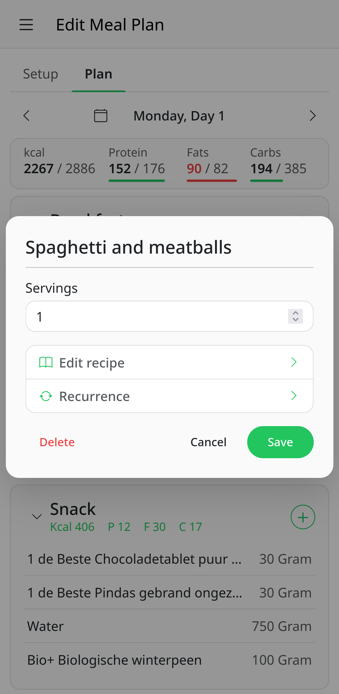

# LibrePlate

**LibrePlate** is a free, open-source, and self-hostable food tracker and meal planner designed to help you manage your nutrition, recipes, and meal planning in one place.

## Features

- **Food & nutrition diary** Track foods, recipes, body metrics, and daily nutrient intake, with an overview of whether you've reached your nutritional goals.
- **Food integrations** Import and track foods from multiple sources:
  - Dirk
  - OpenFoodFacts *(planned)*
  - Albert Heijn *(planned)*
  - PLUS *(planned)*
  - USDA *(planned)*
  - Nutritionix *(planned)*
- **Recipe management** Create, manage, and reuse your own recipes.
- **Grocery generation** Generate grocery lists based on your recipes and meal plans.
- **Statistics & insights** Get insights into your nutrition, body metrics, and progress over time.
- **Meal planning** Create detailed meal plans to organize what you'll eat throughout the day or week.
- **Daily goals** Set personalized daily nutrition goals.

## Screenshots

Note: Screenshots may be out of date! UI changes a lot at the moment.

<p align="center">
  
  
</p>

## Project Status

LibrePlate is currently under active development and is **not yet feature-complete**. At the moment, it provides only the barebones functionality needed to build towards the full vision.

Expect missing features, rough edges, and changes as development continues.

The goal is to gradually turn LibrePlate into a complete, flexible, and privacy-friendly alternative for tracking food, nutrition, and meal planning — while keeping it **free, open-source, and self-hostable**.

## Getting Started

LibrePlate includes a CLI for managing development tasks such as formatting, checking, testing, and deployment like updating, migrating data and running the application. See the manual here: [CLI Manual](cli_manual.md).

To use invoke you will have to create a virtual environment first, and use its
python shell. Install [Python UV](https://docs.astral.sh/uv/getting-started/installation/) and run.

### Configuration

The server needs an `.env` file to be configured in the root directory. This can be coppied over from the `.env_example`. Read the instructions in the file
on how to configure it further.

```
cp .env_example .env
```